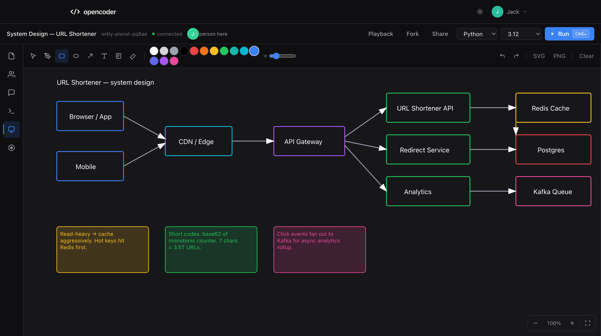
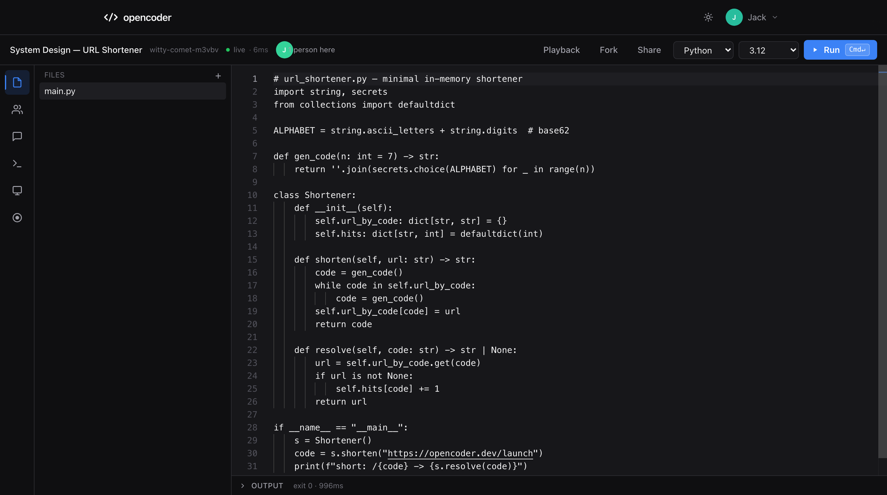
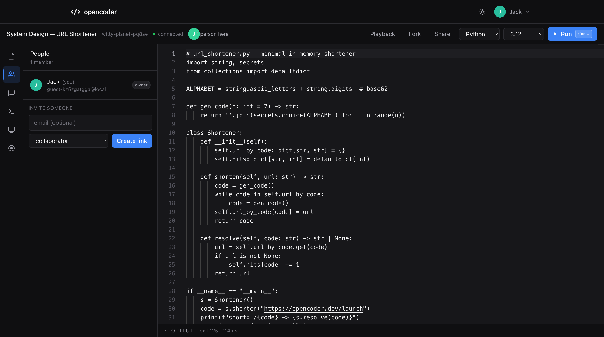
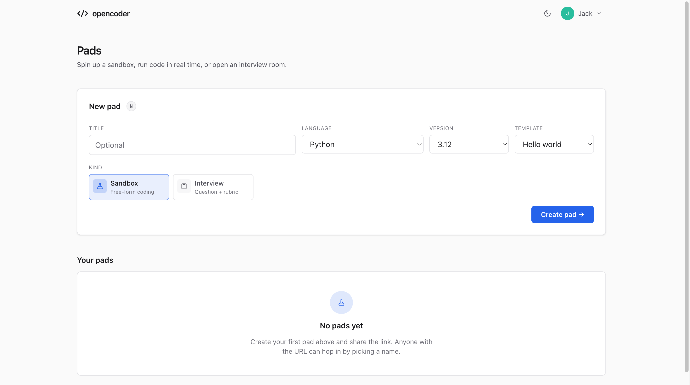
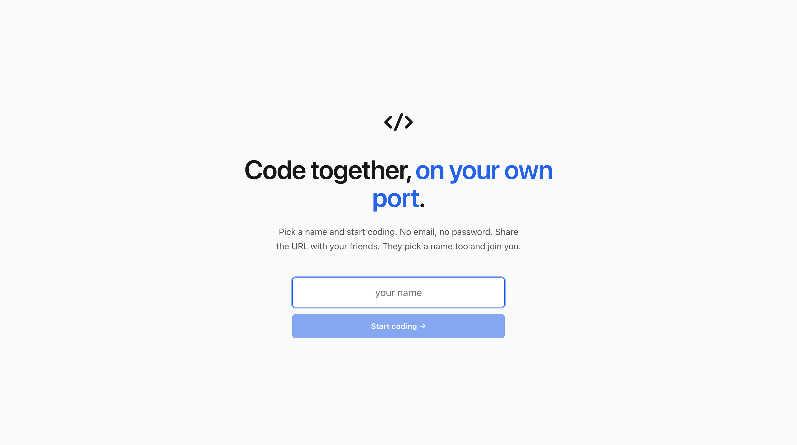
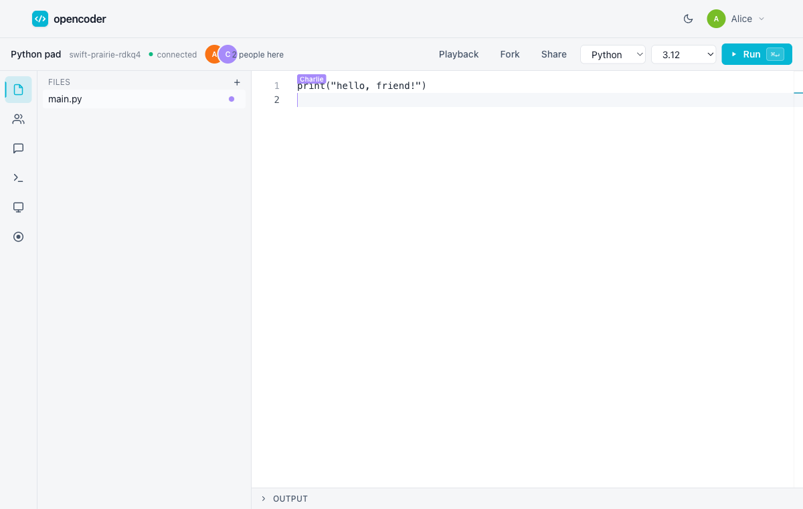

# opencoder

[](./LICENSE)
[](./.nvmrc)
[](./tsconfig.base.json)
[](./docker-compose.yml)

A self-hosted, open-source **CoderPad-style** collaborative coding pad - for you
and your friends, on your own port.

> Run it on your machine. Pick a port. Share the URL with friends. Code,
> debug, run, interview, score - all in real time. No SaaS, no per-seat
> billing, no AI hiring funnel. Just a programmable workspace you control.

<p align="center">
  
  <br />
  <em>Sketch a system design, ship the code, hand the URL to a friend - all in one tab.</em>
</p>

<table align="center" width="100%">
  <tr>
    <td width="50%" align="center">
      
      <br /><sub><b>Editor</b> · Monaco + Yjs · multi-file, multi-language, live cursors</sub>
    </td>
    <td width="50%" align="center">
      
      <br /><sub><b>Members</b> · invite by link · role picker · live presence</sub>
    </td>
  </tr>
  <tr>
    <td width="50%" align="center">
      
      <br /><sub><b>Dashboard</b> · spin up a sandbox or interview room in one click</sub>
    </td>
    <td width="50%" align="center">
      
      <br /><sub><b>Landing</b> · name-only signup · no email, no password</sub>
    </td>
  </tr>
</table>

<p align="center">
  
  <br />
  <em>Two collaborators editing the same file with live cursors.</em>
</p>

## Why opencoder

Closed-source collab pads (CoderPad, Codeshare, CodePad, JDoodle, Replit) all
work fine - until you hit a per-seat invoice, get throttled, or want to keep
your interview transcripts on your own machine. opencoder is the one you
self-host on a port you pick, with no recruiting-funnel upsell. The table
below maps the features that matter for technical interviews + pair coding.

| | **opencoder** | CoderPad | Codeshare | CodePad | Replit-collab |
|---|---|---|---|---|---|
| Self-hosted, your data | Yes MIT | No SaaS | No SaaS | No SaaS | No SaaS |
| Free for unlimited users | Yes | No per-seat | Partial limited free | Partial ads | Partial free tier |
| Real-time CRDT collab | Yes Yjs | Yes | Yes | Partial basic | Yes |
| Multi-file workspaces | Yes | Yes | No | No | Yes |
| Terminal (PTY) inside pad | Yes xterm + node-pty | Yes | No | No | Yes |
| Sandboxed exec (Docker) | Yes + warm pool | Yes | No | Partial remote | Yes |
| Streaming exec output | Yes WebSocket | Yes | No | No | Yes |
| Warm-container pool perf | Yes ~100ms hot, ~500ms cold | Yes | No | No | Yes |
| Compile-artifact cache | Yes LRU 512MB | No | No | No | Partial |
| Code playback / replay | Yes scrubber | Yes | No | No | No |
| Whiteboard canvas | Yes infinite + select + multi + notes + export | Partial basic | No | No | No |
| Cursors-on-canvas presence | Yes | No | No | No | No |
| Export canvas to PNG/SVG | Yes | No | No | No | No |
| Interview rubric + roles | Yes 5-axis | Yes | No | No | Partial |
| Name-only signup (no email) | Yes | No | Partial anon | Partial anon | No |
| One-port deploy | Yes one Docker image | n/a | n/a | n/a | n/a |

<sub>Comparison reflects public docs + free-tier offerings as of May 2026.
opencoder claims are backed by its test suite (44 api / 5 web test
files, 308 tests - run `pnpm test`). Closed competitors may have changed since - open
a PR if a row is stale.</sub>

## Features

- **Multi-language IDE** - Python, JavaScript, TypeScript, Go, Rust, Java,
  C, C++, Ruby, C# - sandboxed in Docker (with a graceful local-subprocess
  fallback when Docker isn't there)
- **Real-time collab** - Yjs CRDT-backed editor, presence + cursors, no
  conflicts
- **Multi-file workspaces** per pad, rename / delete / sort
- **Terminal** with `xterm.js` + `node-pty` (sandboxed shell inside the pad)
- **Chat sidebar** per pad with history
- **Code playback** - scrub the editing timeline like a film strip, replay
  every keystroke + run + chat
- **Interview rooms** with a question bank, candidate-only view, and
  structured 5-axis rubric (correctness / style / communication / problem
  solving / hire-or-not)
- **AI code review** (optional, opt-in) - point at Claude or OpenAI and
  get inline `{file, line, severity, comment}` annotations
- **Invites + share links** with roles: `owner / collaborator / viewer /
  candidate`
- **One-port deploy** - single Docker image serves the SPA + API + WS,
  one `PORT` you choose

## Quickstart - self-host (one port, one command)

```bash
# 1. Clone
git clone https://github.com/your-user/opencoder.git
cd opencoder

# 2. Configure
cp .env.example .env
# Edit .env - at minimum set a strong JWT_SECRET. Pick PORT if you like.
# Generate a secret:
#   openssl rand -hex 32

# 3. Run
docker compose up --build -d

# 4. Visit
open "http://localhost:${PORT:-4000}"

# Friends on your LAN:
#   http://<your-LAN-ip>:${PORT}
# Friends off-LAN: put it behind Tailscale / Cloudflare Tunnel.
```

**Important:** the compose file mounts your host Docker socket so the API
can spawn sandboxed code-runner containers. If you don't want that, set
`EXEC_FORCE_LOCAL=true` in your `.env` - code will run as subprocesses
inside the api container instead. (Less isolated. Friends-only trust.)

## Developing locally

```bash
# 1. Use the supported Node version (matches .nvmrc)
nvm use            # → Node 20
corepack enable    # pnpm 10.12.4 is pinned via package.json

# 2. Install
pnpm install

# 3. Configure
cp .env.example .env
# In .env, set JWT_SECRET. Generate one with:
#   openssl rand -hex 32
# All other vars have sane defaults for local dev.

# 4. Run api (:4000) and web (:5173) together.
# `pnpm predev` runs prisma generate + migrate deploy automatically,
# so the SQLite DB at apps/api/prisma/dev.db is ready before either
# server starts.
pnpm dev
```

Visit <http://localhost:5173>.

If you need to re-run the DB step manually (after a fresh checkout or
pulling new migrations), use `pnpm db:setup`.

## Troubleshooting

- **`Error: JWT_SECRET must be set ... in production`** - you started the
  server with `NODE_ENV=production` and either an empty, short, or default
  `JWT_SECRET`. Generate one with `openssl rand -hex 32` and put it in
  `.env`. The dev fallback is intentionally blocked in prod.
- **`Error: Prisma table not found` / `no such table`** - migrations
  haven't been applied to the configured `DATABASE_URL`. Run
  `pnpm db:setup` (or `pnpm --filter @opencoder/api exec prisma migrate
  deploy`).
- **Port 4000 already in use** - set `PORT` to something free in `.env`
  (Docker) or via `PORT=4123 pnpm dev` (local).
- **`Cannot connect to the Docker daemon`** - either start Docker
  Desktop, or set `EXEC_FORCE_LOCAL=true` in `.env` to fall back to
  subprocess execution. The local fallback is **less isolated** - only use
  it on a single-user machine with code you trust.
- **`pnpm: command not found` or wrong pnpm version** - run
  `corepack enable && corepack prepare pnpm@10.12.4 --activate`. The
  `packageManager` field in `package.json` pins this exact version.
- **Login shows `Invalid token`** after restarting the dev server - you
  changed `JWT_SECRET`. Clear `localStorage` for `localhost:5173` and log
  in again.

## Updating

```bash
git pull
pnpm install                          # picks up new deps
pnpm --filter @opencoder/api exec prisma migrate deploy
# For docker self-host:
docker compose up --build -d
# For local dev:
pnpm dev
```

Always re-run `prisma migrate deploy` after pulling - new migrations are
only applied when you ask. The compose `restart: unless-stopped` policy
means a fresh build replaces the running container in seconds.

## Scripts

| Command            | Purpose                                       |
| ------------------ | --------------------------------------------- |
| `pnpm dev`         | Run api + web in watch mode                   |
| `pnpm build`       | Build all packages                            |
| `pnpm test`        | Unit + integration tests (Vitest)             |
| `pnpm test:e2e`    | Playwright end-to-end suite                   |
| `pnpm typecheck`   | TypeScript no-emit across the workspace       |
| `pnpm lint`        | ESLint                                        |
| `pnpm format`      | Prettier                                      |

## Architecture

```
apps/
  api/        Fastify + Prisma/SQLite + WebSocket multiplex
              (collab, chat, terminal) + Docker code runners
  web/        Vite + React + Monaco + Yjs + xterm.js
packages/
  shared/     Shared types, language registry, WS envelope
```

Pad state lives in SQLite. Editor edits flow over a binary WS envelope:

```
byte 0     : message type (hello / state / update / awareness / chat / ping)
bytes 1-N  : payload (Yjs binary update, JSON, or terminal data)
```

Yjs updates persist as `EditEvent` rows so playback can rebuild a doc state
at any point in time.

## Roles

| Role           | Edit code | Run code | Terminal | Chat | Score | Invite |
| -------------- | :-------: | :------: | :------: | :--: | :---: | :----: |
| `owner` | [OK] | [OK] | [OK] | [OK] | [OK] | [OK] |
| `collaborator` | [OK] | [OK] | [OK] | [OK] | | |
| `candidate` | [OK] | [OK] | [OK] | [OK] | | |
| `viewer` | | | | [OK] | | |

(Candidates differ from collaborators only in the interview UI: they don't
see the interviewer's rubric.)

## Security notes

- **Self-host trust model.** opencoder is designed for groups of friends,
  hackathon teams, or interview crews. It writes an audit log to the
  `AuditLog` SQLite table (failed logins, pad deletes, etc.), but has no
  SOC2 / formal compliance posture. See [SECURITY.md](./SECURITY.md) for
  the full threat model.
- **Don't expose your raw port to the public internet.** Front it with a
  reverse proxy (Caddy, nginx) over HTTPS, or use Tailscale / Cloudflare
  Tunnel for off-LAN access.
- **Code execution** runs in throwaway Docker containers with a memory cap,
  CPU cap, no network, and a tmpfs. If Docker isn't available, fall back to
  local subprocess - only safe with friends you trust.
- **Terminals** spawn a real shell inside the api container (or, if you're
  doing dev, on your laptop). Don't grant `collaborator` to randoms.

## License

MIT - see [LICENSE](./LICENSE).
